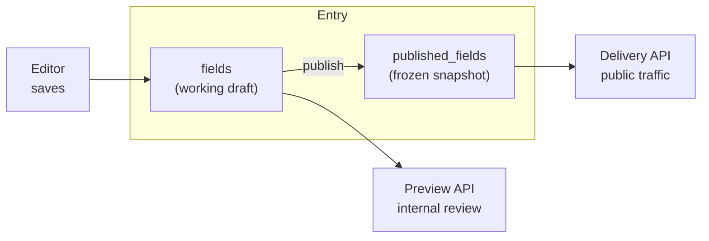
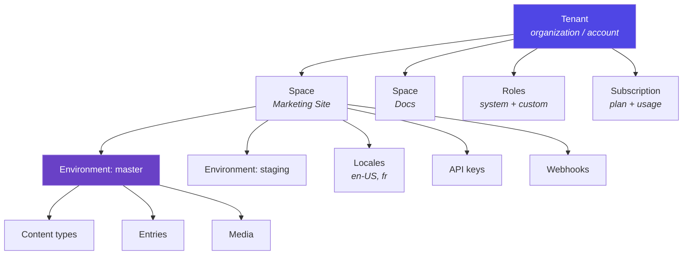
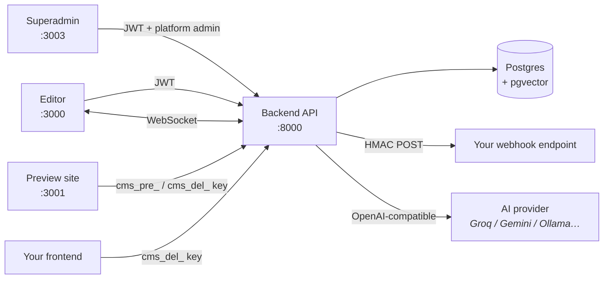

# Overview

Ondros CMS is a **headless, multi-tenant content management system** — a
Contentful-style API-first CMS you can run yourself. Editors model and write
content in a visual editor; your website or app pulls it over a read-only HTTP
API and renders it however it likes.

"Headless" means the CMS has no opinion about your frontend. It stores
structured content and serves JSON. The `preview/` app in this repo is one
example consumer, not a requirement.

## What's in the box

| Capability | What it means |
|---|---|
| **Multi-tenancy** | Organizations → spaces → environments, isolated at every query |
| **Content modeling** | 15 field types, references/assemblies, repeatable multifield groups, per-field localization |
| **Three API planes** | Management (write), Delivery (published), Preview (drafts) |
| **Roles & permissions** | 5 system roles + custom roles over 11 capabilities, org-wide or per-space |
| **Visual editing** | Split-view live preview, click-to-field, inline editing in the rendered page |
| **Rich text** | ProseMirror JSON model with tables, colors, embedded entries/assets |
| **Localization** | First-class locales with fallback chains resolved at delivery |
| **Webhooks** | 13 event types, HMAC-signed, filtered, with a delivery log |
| **AI assistance** | Generate/rewrite/translate/SEO, grounded in your own guidelines |
| **Versioning & audit** | Entry version snapshots with diff + restore; full audit trail |
| **Billing & usage** | Plans, usage counters, enforced limits |
| **Platform admin** | Separate operator dashboard: accounts, revenue, health, impersonation |

## The core idea: draft vs published

Every entry carries **two copies** of its content:

Editing never touches what the public sees. `publish` copies the draft into
`published_fields` and freezes it; the Delivery API only ever reads that frozen
copy. This is why a preview key and a delivery key return different content for
the same entry.

## Concept mapping

If you know Contentful, the vocabulary translates directly:

| Contentful | Ondros | Notes |
|---|---|---|
| Organization | `Tenant` | Called an "account" in the UI |
| Space | `Space` | Owns locales, API keys, webhooks |
| Environment | `Environment` | `master`, `staging`, … — content types **and** entries are environment-scoped |
| Content type | `ContentType` | Schema held as a `FieldDef[]` JSON array |
| Entry | `Entry` | Draft `fields` + frozen `published_fields` |
| Asset | `MediaAsset` | Files on disk by default; swap for object storage |
| Delivery / Preview / Management API | Same three planes | Distinguished by API key prefix |
| Roles | `Role` + `UserRoleAssignment` | Assignable org-wide or scoped to one space |

## The hierarchy

The detail worth internalizing: **content types live inside environments, not
spaces.** Cloning `master` into `staging` copies the schema *and* the entries,
remapping every reference id so the clone is internally consistent. That's what
makes environments usable for real schema migrations rather than just content
staging.

## Who talks to what

## What this is not

Worth being direct about the boundaries, because they shape the deployment
advice in [17-deployment/](17-deployment/):

- **Not horizontally scalable as-is.** The WebSocket manager holds live-preview
  rooms in process memory. Two replicas means two editors silently miss each
  other's updates. Back it with Redis pub/sub before scaling out.
- **Media is local disk by default.** Fine for a single host, wrong for
  ephemeral filesystems. See [18-configuration.md](18-configuration.md).
- **Schema changes run on boot.** `init_db()` does `create_all` plus in-place
  dev migrations. Alembic migrations exist and are the production path.

## Where to go next

- Running it locally → [04-getting-started.md](04-getting-started.md)
- How the pieces fit → [02-architecture.md](02-architecture.md)
- Consuming the content API → [06-api/delivery-api.md](06-api/delivery-api.md)
- Modeling content → [08-content-modeling.md](08-content-modeling.md)
