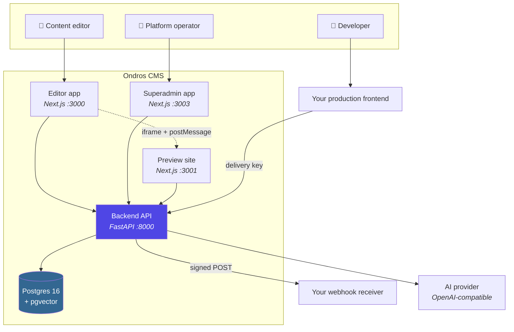
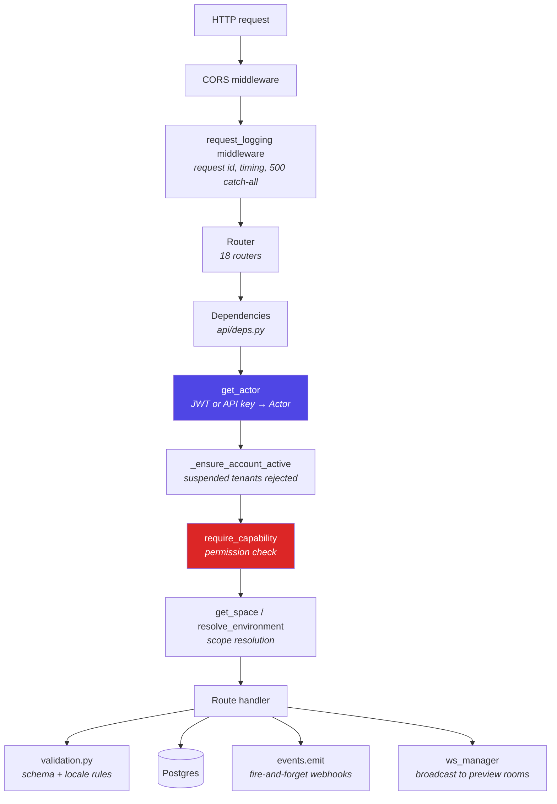
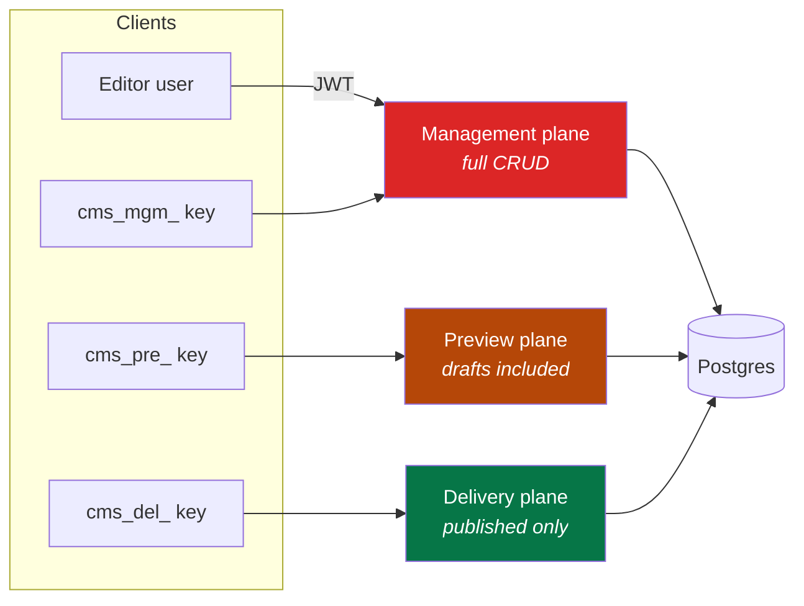
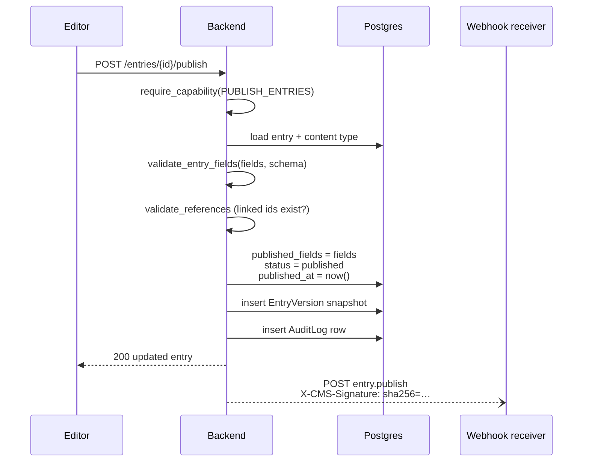
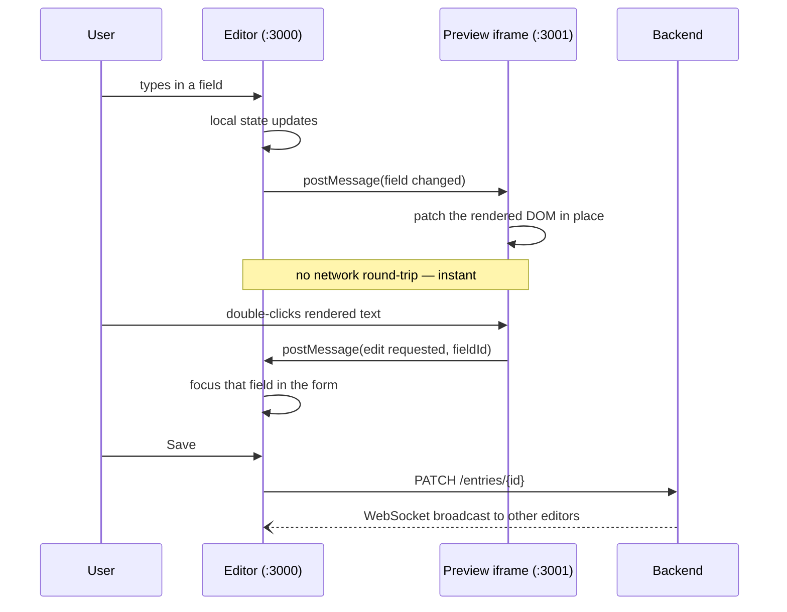
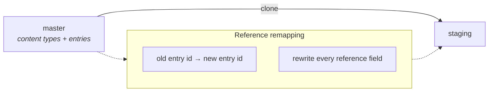
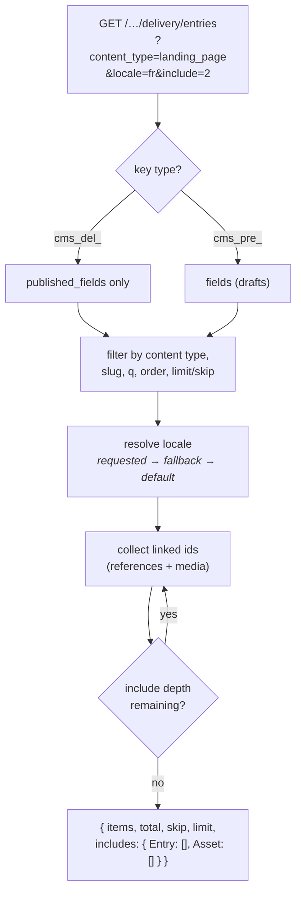

# Architecture

How the pieces fit, and why they're arranged this way.

## System context



Only the **backend** talks to the database. Every frontend — including the ones
in this repo — is just an API client. That's what makes it "headless": you can
delete `preview/` entirely and serve content to anything that speaks HTTP.

## Containers

| Container | Stack | Port | Responsibility |
|---|---|---|---|
| `db` | Postgres 16 + pgvector | 5432 | All persistence, including guideline embeddings |
| `backend` | FastAPI + SQLAlchemy async | 8000 | All three API planes, auth, webhooks, AI, WebSockets |
| `editor` | Next.js 14 App Router | 3000 | Visual editor: modeling, entries, media, settings |
| `preview` | Next.js 14 App Router | 3001 | Demo consumer + inline-editing bridge |
| `superadmin` | Next.js 14 App Router | 3003 | Cross-tenant operator dashboard |

## Backend internals



Every management request converges on one abstraction — the **`Actor`**
(`backend/app/api/deps.py`). It represents "who is asking", whether that's a
logged-in user or a management API key:

```python
@dataclass
class Actor:
    tenant_id: uuid.UUID      # the ACTIVE account
    user: User | None = None
    api_key: ApiKey | None = None
```

The security-critical detail is in its docstring: `tenant_id` comes from the
**validated JWT `account_id` claim, never from the request body**. A user who
belongs to three accounts gets a token scoped to exactly one, and no request
parameter can widen that. Tenant isolation is a property of the token, not of
the query the handler happens to write.

### Layers

```
backend/app/
  main.py          app wiring, middleware, lifespan (init_db)
  config.py        pydantic-settings; env-driven, AI provider auto-detection
  database.py      async engine, session factory, init_db()
  migrations.py    idempotent in-place dev migrations
  seed.py          demo workspace

  api/             HTTP layer — 18 routers, thin; auth via deps.py
  core/            domain logic with no HTTP knowledge:
                     permissions.py  Capability enum, system roles, checks
                     security.py     bcrypt, JWT, API token generate/hash
                     validation.py   locale-aware schema validation
                     events.py       webhook dispatch (HMAC, async, logged)
                     richtext.py     ProseMirror document validation
                     ws_manager.py   per-entry WebSocket rooms
                     usage.py        counters + limit enforcement
                     audit.py        audit trail writer
                     mailer.py       SMTP, or log-only when unconfigured
  models/          SQLAlchemy 2.0 typed models (25 tables)
  ai/              client (multi-provider), retrieval, ingestion, prompts
```

`core/` is where the interesting rules live and it deliberately knows nothing
about FastAPI — which is why `validation.py` and `permissions.py` are directly
unit-testable without spinning up an app.

## The three API planes

One backend, three authentication schemes, three very different trust levels:



The plane is chosen by the **token prefix**, which makes the trust boundary
visible in the credential itself — you can tell at a glance whether a key
leaked into a client bundle is a catastrophe (`cms_mgm_`) or merely public data
(`cms_del_`). Details in [06-api/README.md](06-api/README.md).

## Key flows

### Publishing an entry



Webhook dispatch is **fire-and-forget** (`asyncio` task, not awaited), so a
slow or dead receiver can't make publishing hang. The trade-off: delivery isn't
guaranteed across a restart. Every attempt is recorded in `webhook_deliveries`
so you can see what happened.

### Live preview with inline editing

The feature that makes the editor feel like a page builder rather than a form:



The preview page annotates its markup with `data-cms-*` attributes, which is
how the bridge maps a clicked DOM node back to a field id. Both directions are
`postMessage`, so the preview can be any origin you control.

### Environment cloning



Cloning copies schema **and** content, then rewrites every reference field so
links point at the clone's own entries rather than back at `master`. Without
that remap you'd get a staging environment whose entries silently reference
production content.

## Data flow at delivery time



Links resolve **breadth-first into a flat `includes` map** (`MAX_INCLUDE_DEPTH = 3`,
`MAX_INCLUDED_ENTITIES = 200`), not by nesting objects inside each other. A hero referenced by five entries is serialized once
and referenced five times. The SDK's `resolve()` helper walks that map for you.

## Design decisions worth knowing

| Decision | Why | Cost |
|---|---|---|
| Content types stored as JSONB `fields[]` | Schema changes need no migration; content modeling is a data operation | No FK-level integrity on field definitions; validation is application-side |
| Draft/published as two columns on one row | Publishing is atomic and cheap; no join to read published content | Only one draft in flight per entry |
| References resolved app-side, not SQL joins | Depth without recursive CTEs; BFS, one round of queries per level | `include=3` means 3 sequential rounds; capped at 200 included entities |
| Webhooks fire-and-forget | Publishing latency stays flat | No delivery guarantee across restarts |
| WebSocket rooms in process memory | Zero infrastructure for live preview | **Breaks with >1 replica** — see [01-overview.md](01-overview.md) |
| `create_all` on boot + Alembic available | Works on first run with no migration step | Boot-time schema changes are wrong for production; use Alembic |

## Where to go next

- The tables behind all this → [05-data-model.md](05-data-model.md)
- How permissions are enforced → [07-auth-and-permissions.md](07-auth-and-permissions.md)
- The API surface → [06-api/README.md](06-api/README.md)
- Frontend structure → [09-frontend-apps.md](09-frontend-apps.md)
