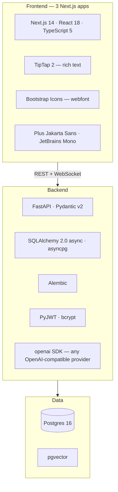

# Tech stack

Every technology in the repo, and why it's there.

## At a glance

## Backend

| Package | Version | Why this one |
|---|---|---|
| **FastAPI** | `>=0.115,<1` | Async-native, and its Pydantic integration generates the OpenAPI schema that powers `/docs`, the SDK types and the CLI's codegen — one source of truth instead of three |
| **Uvicorn** | `>=0.30` | ASGI server. `[standard]` pulls in `uvloop`/`httptools` |
| **SQLAlchemy** | `>=2.0.30` | 2.0's typed `Mapped[...]` models give real type checking over the ORM |
| **asyncpg** | `>=0.29` | Fastest async Postgres driver. Note it rejects libpq options like `sslmode` — the deployment gotcha |
| **pgvector** | `>=0.3.2` | Vector column type for guideline embeddings, so semantic search is a SQL query rather than a separate service |
| **Pydantic** | `>=2.7` | Request/response validation. v2's Rust core matters on hot delivery endpoints |
| **pydantic-settings** | `>=2.3` | Typed env configuration in `config.py` |
| **PyJWT** | `>=2.8` | Access tokens. Refresh tokens are opaque and DB-backed instead |
| **bcrypt** | `>=4.1` | Password hashing with a deliberate work factor |
| **Alembic** | `>=1.13` | Real migrations, the production alternative to boot-time `create_all` |
| **openai** | `>=1.40` | Used as a *client protocol*, not a vendor lock-in — Groq, Gemini, Ollama and OpenRouter all speak the same API |
| **httpx** | `>=0.27` | Async HTTP for webhook delivery and OIDC |
| **Pillow** | `>=10.3` | Image dimensions and variants on upload |
| **Authlib** | `>=1.3` | OIDC/OAuth flows |
| **Stripe** | `>=9.0` | Checkout and billing webhooks |
| **python-multipart** | `>=0.0.9` | Multipart parsing for media upload |

`python3-saml` is listed but commented out: it needs `xmlsec` system libraries, so SAML is scaffolded rather than runtime-enabled.

## Frontend

All three apps (`editor`, `preview`, `superadmin`) share the same base:

| Package | Version | Why |
|---|---|---|
| **Next.js** | `14.2` | App Router. Server components keep static content (legal pages, docs) out of the client bundle |
| **React** | `18.3` | |
| **TypeScript** | `5.5` | `npm run typecheck` is the frontend's test suite |
| **bootstrap-icons** | `1.13` | Icon **webfont** — `<i class="bi bi-…">` inherits `currentColor` and `font-size`, so design tokens apply with no per-icon work |

The editor additionally uses **TipTap 2** (`@tiptap/*`) over ProseMirror for rich text: colour, highlight, tables, underline, links, plus custom nodes for embedded entries and assets.

### Deliberately absent

Worth stating, because their absence is a decision rather than an oversight:

- **No CSS framework.** Styling is plain CSS with custom properties in each app's `globals.css`. Dependency-free, and the design tokens are readable in one place.
- **No component library.** `components/ui/` holds the handful of primitives actually needed (Modal, Select, Toast, StatusPage). The themed `Select` exists because a native `<select>` popup is drawn by the OS and ignores every token.
- **No client state library.** React context (`WorkspaceProvider`) plus local state is enough; there is no cross-cutting client cache to manage.
- **No NextAuth.** Auth is entirely the FastAPI backend's job, so there's no `NEXTAUTH_SECRET` to configure.

### Typography

**Plus Jakarta Sans** (UI) and **JetBrains Mono** (code) — the same pair as the marketing site. The woff2 files are **vendored** under `<app>/src/app/fonts/` and loaded with `next/font/local` rather than `next/font/google`, because the Google Fonts CDN resolves IPv6-only from the Docker bridge network and the build fails there — and in any offline CI. Vendoring makes the build hermetic.

## Data

| | |
|---|---|
| **Postgres 16** | Via the `pgvector/pgvector:pg16` image locally |
| **pgvector** | `CREATE EXTENSION vector` runs automatically at boot |
| **JSONB** | Content-type schemas, entry fields, webhook filters and role permissions are all JSONB — modelling content is a data operation, not a migration |

`EMBEDDING_DIM` sizes the vector column and is **fixed at first ingest** (1536 for OpenAI, 768 for Gemini/Ollama). Changing it later requires recreating the column.

## Tooling

| | |
|---|---|
| **Docker Compose** | Five services for local dev; volume mounts give hot reload on both sides |
| **pytest** | 59 backend tests against a real Postgres, not mocks |
| **tsc --noEmit** | Type checking per frontend app |

## Version policy

The backend pins **floors, not ceilings** (`fastapi>=0.115,<1`) — patches arrive without edits, majors don't arrive by surprise. The frontends use caret ranges with committed lockfiles, so CI installs exactly what you developed against.

## Where to go next

- Running it → [04-getting-started.md](04-getting-started.md)
- How it fits together → [02-architecture.md](02-architecture.md)
- Every configuration value → [18-configuration.md](18-configuration.md)
