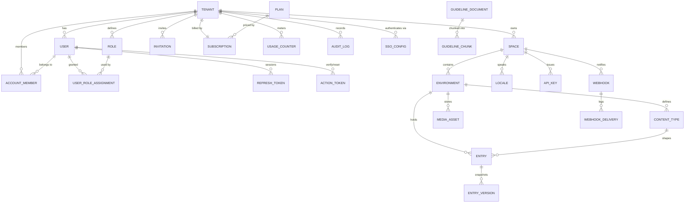
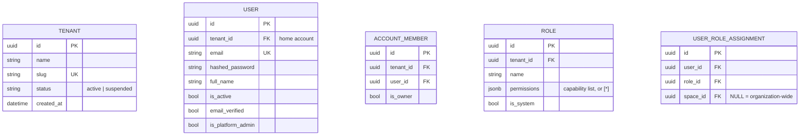
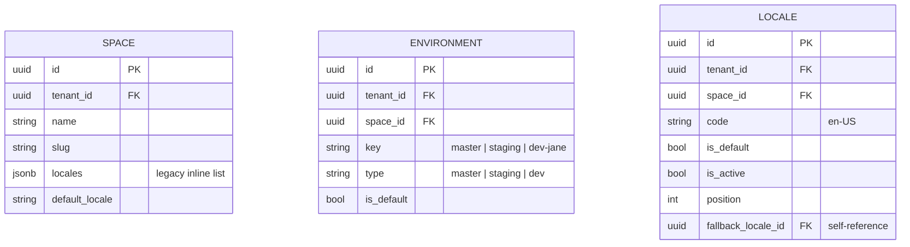
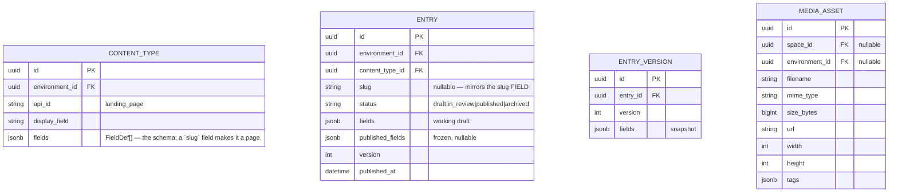
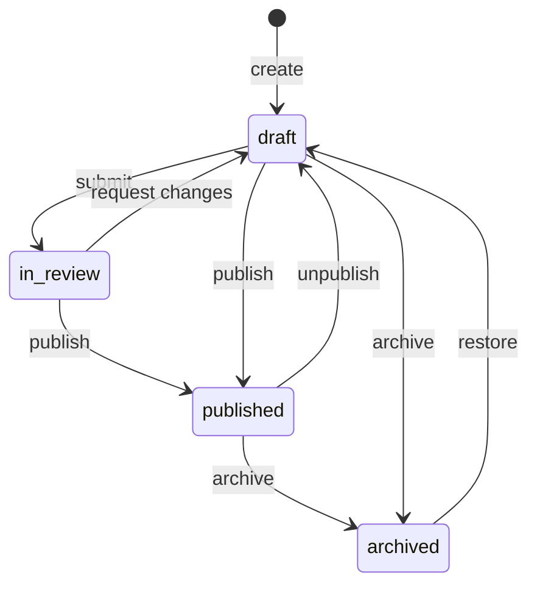
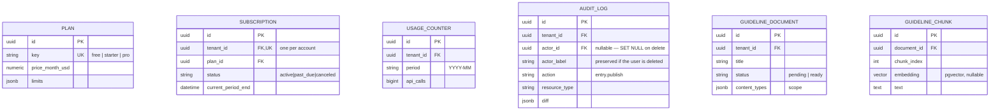

# Data model

25 tables. SQLAlchemy 2.0 typed models in `backend/app/models/`, Postgres 16
with pgvector.

## The whole picture



## Tenancy

The isolation boundary is `tenant_id`, carried on almost every table.



Two details that shape everything else:

- **`User.tenant_id` is the home account, not the current one.** A user can
  belong to several accounts through `AccountMember`; the *active* account comes
  from the JWT's membership-validated `account_id` claim. This is why
  `Actor.tenant_id` in `deps.py` never reads a request parameter.
- **`UserRoleAssignment.space_id` is nullable, and the null means something.**
  `NULL` grants the role organization-wide; a value scopes it to one space.
  That single column is how "editor on the marketing site, viewer everywhere
  else" works.

`Tenant.status = 'suspended'` is enforced on every request by
`_ensure_account_active`, across all three API planes at once.

## Spaces, environments, locales



`Locale.fallback_locale_id` points at another `Locale`, so fallbacks form a
chain rather than a single hop. Delivery walks it with a `visited` set, because
nothing stops an editor creating `fr → de → fr`.

`Space.locales` (JSONB) predates the `Locale` table and is kept for
compatibility. The `Locale` rows are the source of truth.

## Content



The three decisions worth understanding:

**Content types are environment-scoped.** `ContentType.environment_id`, not
`space_id`. Cloning `master` into `staging` therefore copies the schema *and*
the entries, remapping every reference id so the clone is self-consistent. That
is what makes environments usable for schema migration rather than just content
staging.

**The schema is JSONB, not tables.** `ContentType.fields` holds a `FieldDef[]`.
Adding a field is an `UPDATE`, not a migration — but it also means there is no
foreign-key integrity on field definitions, so `core/validation.py` carries that
weight in application code.

**Draft and published live on the same row.** `fields` is what the editor
writes; `published_fields` is a frozen copy taken at publish time and is what
the Delivery API reads. `published_fields IS NULL` means never published. One
row, no join, atomic publish — at the cost of only one in-flight draft per entry.



Every transition snapshots the entry into `entry_versions`, bumps `version`, and
writes an `audit_logs` row. Publishing additionally validates the fields and
checks that every referenced id still exists.

## Auth and API keys

```mermaid
erDiagram
    API_KEY {
        uuid id PK
        uuid space_id FK
        string type "delivery|preview|management"
        string token_prefix "shown in the UI"
        string token_hash UK "sha256 — never the token"
        jsonb environment_ids "[] = all"
        bool enabled
        datetime last_used_at
    }
    REFRESH_TOKEN {
        uuid id PK
        uuid user_id FK
        uuid tenant_id FK "the account this session is scoped to"
        string token_hash UK
        datetime expires_at
        datetime revoked_at
    }
    ACTION_TOKEN {
        uuid id PK
        uuid user_id FK
        string purpose "verify_email | reset_password"
        string token_hash UK
        datetime used_at "single use"
    }
    SSO_CONFIG {
        uuid id PK
        uuid tenant_id FK
        string provider_type "oidc | saml"
        string email_domain "\"\" = any"
        string default_role_name "JIT provisioning"
        bool enforced
    }
```

Every credential is stored **hashed**, never in plaintext — API keys, refresh
tokens and action tokens alike. A database leak yields no usable secrets. The
UI can still show `token_prefix` so a key is recognisable in a list.

Access JWTs are stateless and *not* stored; refresh tokens are opaque, rotate on
every use, and are revocable — which is what makes "sign out everywhere" and
"changing your password ends other sessions" possible.

## Billing, audit, AI



`AuditLog.actor_label` is denormalised on purpose: `actor_id` is `SET NULL` when
a user is deleted, and an audit trail that forgets who did something is not an
audit trail.

`GuidelineChunk.embedding` is nullable because chat-only providers (Groq,
OpenRouter) produce no embeddings. Retrieval falls back to keyword search rather
than failing — `GET /ai/status` reports which mode is live. The vector's
dimension is fixed by `EMBEDDING_DIM` **when the column is created**, so
changing providers later means recreating it.

## Conventions

| | |
|---|---|
| Primary keys | UUID, generated application-side (`uuid_pk()`) |
| Timestamps | `created_at` / `updated_at` with timezone, server defaults |
| Cascades | `CASCADE` for ownership (delete a space → its content goes); `SET NULL` for attribution (delete a user → their entries survive, authorship blanks) |
| Flexible data | JSONB for schemas, field values, webhook filters, role permissions and plan limits |
| Indexes | On every `tenant_id`, `space_id`, `environment_id`, plus `slug` and `status` for delivery filtering |

## Migrations

`init_db()` runs `CREATE EXTENSION vector`, `create_all`, then the idempotent
in-place upgrades in `app/migrations.py` — convenient on first boot, wrong for
production. Alembic revisions `0001_saas_upgrade` and `0002_platform_admin` are
the real path; see [18-configuration.md](18-configuration.md).

## Where to go next

- Field types and validation → [08-content-modeling.md](08-content-modeling.md)
- How permissions are evaluated → [07-auth-and-permissions.md](07-auth-and-permissions.md)
- Reading this data over HTTP → [06-api/README.md](06-api/README.md)
