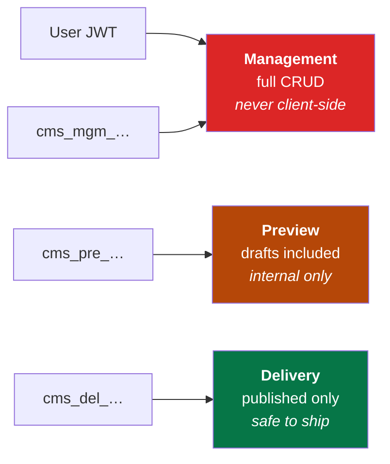

# API overview

126 HTTP operations plus one WebSocket, served by a single FastAPI app on
`:8000`. Interactive Swagger UI lives at **`/docs`** and always reflects the
running build — these pages explain the shapes and rules behind it.

## The three planes

One backend, three credential types, three very different trust levels. The
plane is decided by the **token prefix**, which puts the trust boundary in the
credential itself.



| Plane | Credential | Reads | Writes | Reference |
|---|---|---|---|---|
| **Management** | User JWT, or `cms_mgm_…` | Everything | Everything | [management-api.md](management-api.md) |
| **Preview** | `cms_pre_…` | Drafts + published | No | [delivery-api.md](delivery-api.md) |
| **Delivery** | `cms_del_…` | Published only | No | [delivery-api.md](delivery-api.md) |
| **Platform admin** | User JWT with `is_platform_admin` | Across all tenants | Yes | [platform-admin-api.md](platform-admin-api.md) |
| **Realtime** | User JWT | Entry updates | Broadcasts | [websocket-api.md](websocket-api.md) |

A leaked `cms_del_` key exposes content you already publish publicly. A leaked
`cms_mgm_` key is an incident. Choose accordingly, and never put anything but a
delivery key in a browser bundle.

## Authenticating

**User JWT** — from `POST /auth/login` (JSON) or `POST /auth/token` (OAuth2
form, which is what Swagger's *Authorize* button uses):

```bash
TOKEN=$(curl -s -X POST localhost:8000/auth/login \
  -H 'Content-Type: application/json' \
  -d '{"email":"admin@example.com","password":"admin123"}' | jq -r .access_token)

curl localhost:8000/auth/me -H "Authorization: Bearer $TOKEN"
```

Access tokens are short-lived and stateless. Refresh tokens are opaque, stored
hashed, and **rotate on every use** — `POST /auth/refresh` revokes the one you
present and issues a new pair. Reusing a rotated token fails.

**API keys** — created per space in the UI or via `POST /spaces/{id}/api-keys`,
shown **once**, stored only as a hash:

```bash
# Header form
curl "…/delivery/entries" -H "Authorization: Bearer cms_del_…"

# Query form — for contexts that can't set headers (RSS readers,  tags)
curl "…/delivery/entries?access_token=cms_del_…"
```

Both forms work on the delivery plane. Prefer the header: query strings end up
in server logs, browser history and referrer headers.

## The account claim

Every access JWT carries an `account_id` claim, validated against membership
when the token is issued. The server takes the active tenant **from that claim
and never from a request parameter**, so no amount of body or query tampering
widens a user's scope. A user in three organizations holds a token scoped to
exactly one and calls `POST /auth/switch-account` to move.

## URL shape

Most management routes are scoped by space and environment:

```
/spaces/{space_id}/environments/{environment}/content-types
/spaces/{space_id}/environments/{environment}/entries
/spaces/{space_id}/environments/{environment}/delivery/entries
```

`{environment}` accepts the **key** (`master`) or the environment UUID — keys
are what you want in code. Entry-level operations are flat, because an entry id
already implies its environment:

```
/entries/{entry_id}
/entries/{entry_id}/publish
```

## Conventions

**Pagination** is `skip`/`limit`. List responses return:

```json
{ "items": [...], "total": 128, "skip": 0, "limit": 50 }
```

`limit` defaults to 50 and is capped at 200 on delivery.

**Errors** are FastAPI's shape — `{"detail": "..."}`, or an array of field
errors for 422:

| Code | Meaning |
|---|---|
| 400 | Malformed request, or a rule violated (e.g. wrong current password) |
| 401 | Missing, invalid, expired or disabled credential |
| 402 | Plan limit reached — see [13-billing-and-usage.md](../13-billing-and-usage.md) |
| 403 | Authenticated, but lacking the capability (or the account is suspended) |
| 404 | Not found, **or** not yours — absence and denial look identical on purpose |
| 409 | Conflict, e.g. a duplicate `api_id` or slug |
| 422 | Schema validation failed; `detail` lists the offending fields |
| 429 | Rate limit exceeded |
| 500 | Unhandled — the response carries a `request_id` matching the server log |

Every response includes an **`X-Request-Id`** header. Quote it when reporting a
problem; it is the key into the structured request log.

**Content type** is `application/json` everywhere except media upload, which is
`multipart/form-data`.

## Operations by area

| Area | Ops | What |
|---|---|---|
| `auth` | 12 | Signup, login, refresh, verification, password reset, profile |
| `entries` | 13 | Entry CRUD, workflow transitions, bulk actions, versions |
| `platform-admin` | 13 | Cross-tenant operator API |
| `sso` | 11 | OIDC/SAML config, social login callbacks |
| `users-roles` | 10 | Users, roles, assignments |
| `spaces` | 8 | Spaces and environments, including cloning |
| `ai` | 7 | Generation, rewriting, translation, compliance |
| `accounts` | 6 | Membership and invitations |
| `media` | 6 | Upload, listing, variants |
| `guidelines` | 6 | Ingestion for AI grounding |
| `webhooks` | 6 | Endpoints and delivery log |
| `content-types` | 5 | Schema CRUD |
| `locales` | 5 | Locales and fallback chains |
| `api-keys` | 5 | Key issue and revoke |
| `billing` | 5 | Plans, subscription, checkout |
| `delivery` | 5 | Public read plane |
| `audit` | 2 | Audit trail |

## Generated artefacts

The OpenAPI schema is the source of truth for more than the docs page:

```bash
# Export the schema
docker compose exec backend python -m scripts.export_openapi

# Generate TypeScript types for your frontend
npx ondros-cli generate-types
```

See [14-sdk.md](../14-sdk.md) and [15-cli.md](../15-cli.md).

## Where to go next

- Reading content → [delivery-api.md](delivery-api.md)
- Writing content → [management-api.md](management-api.md)
- Live updates → [websocket-api.md](websocket-api.md)
- Who can do what → [07-auth-and-permissions.md](../07-auth-and-permissions.md)
