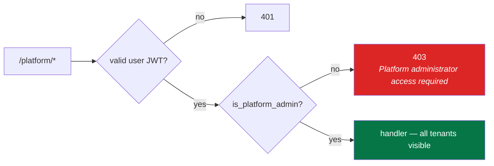
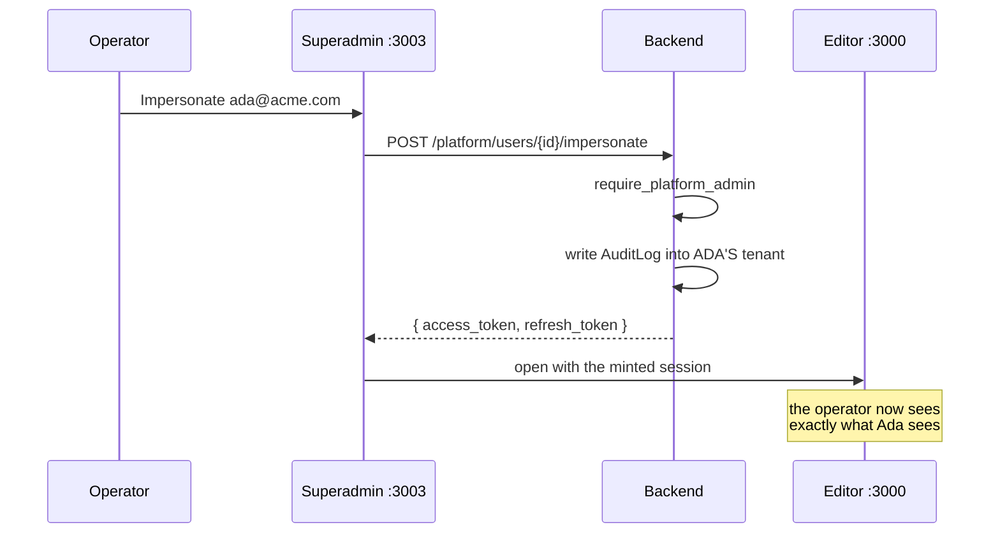

# Platform Admin API

Operator tooling that deliberately **crosses tenant boundaries**. Thirteen
endpoints under `/platform`, consumed by the superadmin app on `:3003`.

Every other API in this system is scoped to one account by the token's
`account_id` claim. This one is not — which is exactly why it is gated
differently and audited harder.

## Access

Requires a normal user JWT **plus** `User.is_platform_admin = true`. There is
no API-key path in: a `cms_mgm_` key can never reach `/platform`, so a leaked
integration credential cannot escalate across tenants.

The flag is set directly in the database or by the seed; there is no endpoint
that grants it, so platform admin cannot be self-assigned through the API.

## Endpoints

### Gate

| Method | Path | Purpose |
|---|---|---|
| `GET` | `/platform/me` | Login gate for the superadmin app — `200` only for platform admins |

The superadmin app calls this on boot and bounces anyone else to its login.

### Dashboards

| Method | Path | Returns |
|---|---|---|
| `GET` | `/platform/overview` | Headline counts — accounts, users, spaces, entries |
| `GET` | `/platform/revenue` | Subscriptions grouped by plan, with monthly totals |
| `GET` | `/platform/usage` | Usage counters and who is near their limits |
| `GET` | `/platform/health` | Service health — database connectivity, AI provider status |

### Accounts

| Method | Path | Purpose |
|---|---|---|
| `GET` | `/platform/accounts` | List every tenant, with plan and usage |
| `GET` | `/platform/accounts/{account_id}` | One account in detail |
| `POST` | `/platform/accounts/{account_id}/suspend` | Set `status = suspended` |
| `POST` | `/platform/accounts/{account_id}/reactivate` | Restore to `active` |

**Suspension bites immediately and across all three planes.** Every
authenticated request runs `_ensure_account_active`, so a suspended tenant's
users are locked out of the editor *and* its delivery keys stop serving content
— not just the UI. Nothing is deleted; reactivation restores everything.

### Users

| Method | Path | Purpose |
|---|---|---|
| `GET` | `/platform/users` | Search users across all tenants |
| `POST` | `/platform/users/{user_id}/suspend` | Deactivate |
| `POST` | `/platform/users/{user_id}/reactivate` | Reactivate |
| `POST` | `/platform/users/{user_id}/impersonate` | Issue a token pair **as** that user |

## Impersonation

Support tooling: mints a normal access/refresh pair for the target user in
their home account, which the superadmin app hands to the editor so an operator
can see precisely what the customer sees.

Two properties worth stating plainly:

- **The token is indistinguishable from a real login.** Anything the user could
  do, the operator can now do. Treat the capability as equivalent to their
  password.
- **It is always audited into the target tenant's own trail**, not a separate
  operator log — so the customer can see that an operator entered their
  account, at `/settings/audit-log`. That is the point: impersonation you can
  hide is a backdoor.

## Errors

| Code | Meaning |
|---|---|
| 401 | No or invalid user JWT |
| 403 | Authenticated but not a platform admin, or an API key was used |
| 404 | No such account or user |

## Where to go next

- The dashboard that consumes this → [09-frontend-apps.md](../09-frontend-apps.md)
- The audit trail → [management-api.md](management-api.md)
- Deploying the superadmin app → [../17-deployment/](../17-deployment/)
