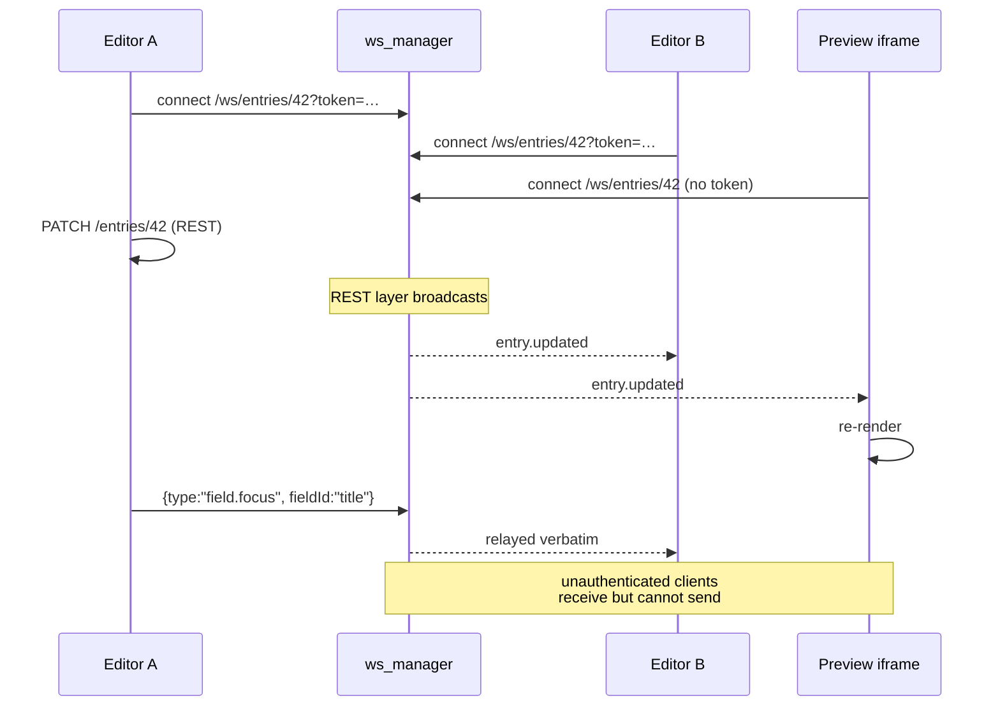

# WebSocket API

One endpoint, used for live preview and editor presence.

```
ws://localhost:8000/ws/entries/{entry_id}?token=<jwt>
```

## What it's for



The socket carries **notifications, not writes**. Every persisted change goes
through the REST API; the socket exists so other viewers learn about it without
polling.

## Authentication

| Connection | Can receive | Can send |
|---|---|---|
| `?token=<valid JWT>` | Yes | Yes |
| No token | Yes | **No** |
| `?token=<invalid>` | Rejected, close code `4401` | — |

Unauthenticated read-only connections exist because the preview iframe has no
JWT. That is a deliberate trade-off for local development: anyone who can reach
the port can observe an entry id they can guess.

> **Harden this before exposing the backend publicly** — require a JWT or a
> preview secret. The module's own docstring says the same.

## Server events

Broadcast by the REST layer after a successful write:

```jsonc
// after PATCH /entries/{id}
{
  "type": "entry.updated",
  "entryId": "b18c1722-…",
  "version": 7,
  "status": "draft",
  "fields": { "title": "Welcome", … },
  "changed": ["title"]          // field ids that actually changed
}

// after publish / unpublish / archive / transition
{
  "type": "entry.transitioned",
  "entryId": "b18c1722-…",
  "status": "published",
  "version": 8
}
```

`changed` lets a client patch only the affected DOM rather than re-rendering.

## Client messages

Any JSON object sent by an **authenticated** client is relayed verbatim to the
other members of that room. It is never persisted. The convention in this
codebase:

```jsonc
{ "type": "field.focus", "fieldId": "title", "user": "ada@example.com" }
```

Used for presence — "someone else is editing this field". Invent your own
types freely; the server does not interpret them.

## Rooms

One room per `entry_id`, held in **process memory** (`core/ws_manager.py`).
Joining is implicit on connect, leaving on disconnect.

> **This is the single hardest constraint on scaling.** With two backend
> replicas, editors connected to different instances silently never see each
> other. Back the manager with Redis pub/sub before running more than one.

## Client example

```ts
const ws = new WebSocket(
  `${API_URL.replace(/^http/, 'ws')}/ws/entries/${entryId}?token=${accessToken}`
);

ws.onmessage = (e) => {
  const msg = JSON.parse(e.data);
  if (msg.type === 'entry.updated') applyFields(msg.fields, msg.changed);
  if (msg.type === 'entry.transitioned') setStatus(msg.status);
};

// Presence signal
ws.send(JSON.stringify({ type: 'field.focus', fieldId: 'title' }));
```

The editor's implementation is `editor/src/lib/useEntrySocket.ts`, which also
handles reconnection and exposes a sync indicator.

## Close codes

| Code | Meaning |
|---|---|
| `1000` | Normal close |
| `4401` | Token supplied but invalid or expired — reconnect with a fresh one |

## Where to go next

- The REST writes that trigger these events → [management-api.md](management-api.md)
- How the editor consumes it → [09-frontend-apps.md](../09-frontend-apps.md)
