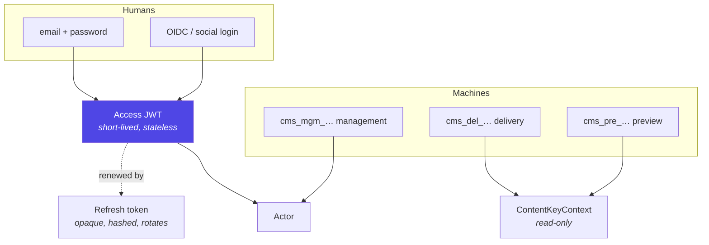
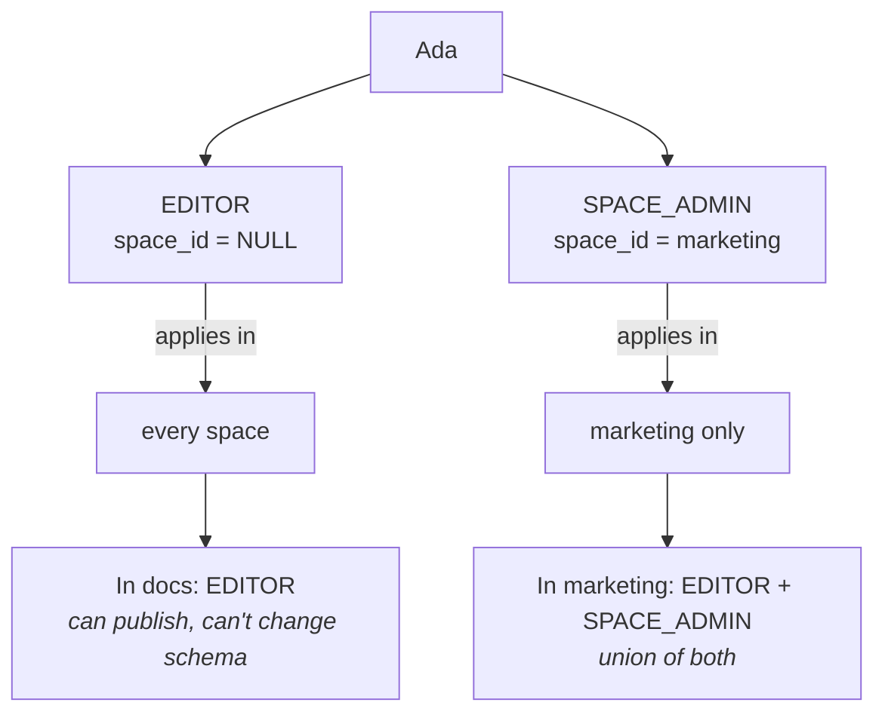
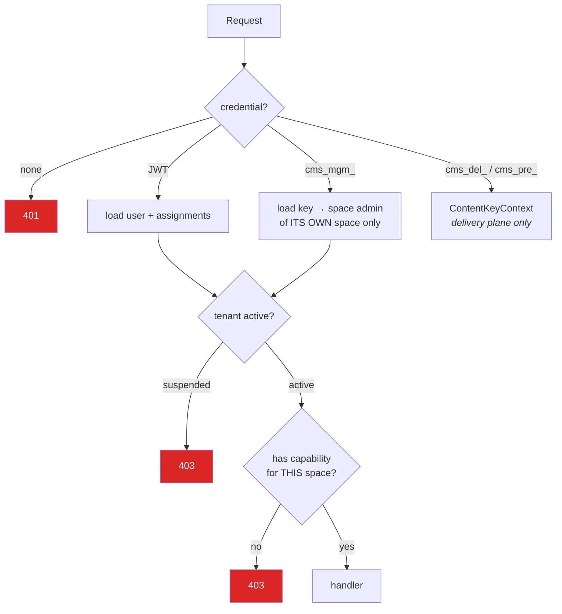
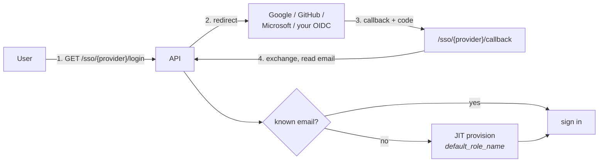

# Authentication & permissions

Who you are, which account you're acting in, and what you're allowed to do —
three separate questions the system answers separately.

## Credentials



### Tokens

| | Access JWT | Refresh token | API key |
|---|---|---|---|
| Format | Signed JWT | Opaque random | `cms_<type>_<random>` |
| Stored server-side | No | Yes, hashed | Yes, hashed |
| Revocable | No — wait for expiry | Yes | Yes |
| Rotates | — | On every use | On regenerate |
| Claims | `sub`, `account_id`, `roles[]`, `type=access` | — | — |

Nothing sensitive is stored in recoverable form. A database leak yields bcrypt
password hashes and SHA-256 token hashes — no usable credentials.

**Refresh rotation:** presenting a refresh token revokes it and issues a new
pair. Reusing a spent token fails, which makes theft detectable and limits the
window.

## The account claim

The detail that carries most of the multi-tenant security:

```python
@dataclass
class Actor:
    tenant_id: uuid.UUID      # the ACTIVE account
    user: User | None = None
    api_key: ApiKey | None = None
```

`tenant_id` is resolved from the **validated JWT `account_id` claim**, checked
against `AccountMember` when the token is issued — never from a request body,
query parameter or header. A user in three organizations holds a token scoped
to exactly one and calls `POST /auth/switch-account` to move.

The consequence: tenant isolation is a property of the *token*, not of every
individual query a handler happens to write. A handler that forgets a
`WHERE tenant_id = …` is a bug, but it cannot be triggered by a crafted request.

## Capabilities

Twelve capabilities, checked per request:

| Capability | Grants |
|---|---|
| `read_content` | View content types, entries, media |
| `manage_entries` | Create, edit and delete **drafts** |
| `publish_entries` | Publish, unpublish, archive |
| `manage_content_types` | Change the schema |
| `manage_media` | Upload and delete assets |
| `manage_settings` | Space settings and locales |
| `manage_environments` | Create, clone and delete environments |
| `manage_api_keys` | Issue and revoke keys |
| `manage_webhooks` | Configure webhooks |
| `manage_users` | Users and role assignments (org-level) |
| `manage_spaces` | Create and delete spaces (org-level) |
| `use_ai` | AI assistance and guideline ingestion |

The split between `manage_entries` and `publish_entries` is what makes AUTHOR
meaningful: write all you like, but someone else decides what goes live.

## System roles

| | ORG_ADMIN | SPACE_ADMIN | EDITOR | AUTHOR | VIEWER |
|---|:-:|:-:|:-:|:-:|:-:|
| `read_content` | ✓ | ✓ | ✓ | ✓ | ✓ |
| `manage_entries` | ✓ | ✓ | ✓ | ✓ | |
| `manage_media` | ✓ | ✓ | ✓ | ✓ | |
| `use_ai` | ✓ | ✓ | ✓ | ✓ | |
| `publish_entries` | ✓ | ✓ | ✓ | | |
| `manage_content_types` | ✓ | ✓ | | | |
| `manage_settings` | ✓ | ✓ | | | |
| `manage_environments` | ✓ | ✓ | | | |
| `manage_api_keys` | ✓ | ✓ | | | |
| `manage_webhooks` | ✓ | ✓ | | | |
| `manage_users` | ✓ | | | | |
| `manage_spaces` | ✓ | | | | |

ORG_ADMIN holds the wildcard `["*"]` rather than an enumerated list, so a new
capability is automatically included. System roles cannot be edited or deleted;
create a custom role instead — any subset of the twelve, via `POST /roles`.

## Scoping: the nullable column

`UserRoleAssignment.space_id` is nullable, and the null means
*organization-wide*:



Effective capabilities are the **union** of every applicable assignment
(`user_capabilities` in `core/permissions.py`). Grants add; nothing subtracts.
There is no deny rule, so a permission question is always "does any assignment
grant this?"

When `account_id` is supplied — the multi-account case — only roles belonging
to that account count, so switching accounts genuinely changes what you can do.

## How a request is authorised



A management API key behaves as a space admin **of its own space only** — it
cannot reach sibling spaces even within the same account, and never reaches
`/platform`.

Capabilities are re-evaluated **server-side on every request**. The
`capabilities` array in `/auth/me` is for hiding menu items the user can't use;
it is a UI convenience, never a security boundary.

## 404 vs 403

Asking for something in another tenant returns **404, not 403** — absence and
denial are deliberately indistinguishable, so the API can't be used to probe
for which ids exist. `403` is reserved for resources you can see but lack the
capability to act on.

## Sessions

| Action | Effect |
|---|---|
| `POST /auth/change-password` | Revokes every **other** refresh token; your current access token survives until expiry |
| `POST /auth/sign-out-everywhere` | Revokes all refresh tokens for the user |
| Suspending a user | Blocks new authentication |
| Suspending a tenant | Blocks every plane at once, including delivery keys |

Because access JWTs are stateless, revocation applies at the *refresh* step —
an already-issued access token remains valid until it expires. Keep the access
lifetime short.

## SSO and social login



- Per-account **enterprise SSO** is configured in Settings → Security
  (`SSOConfig`): OIDC discovery URL, client id/secret, an `email_domain` to
  match on, the role for JIT-provisioned users, and an `enforced` flag that
  turns off password login for that domain.
- **Social login** (Google/GitHub/Microsoft) is configured globally by env var.
  Unknown emails get a personal account.
- Redirect URIs always derive from `BACKEND_URL`, so each environment needs
  only its own value — register
  `{BACKEND_URL}/sso/<provider>/callback` with the provider.
- SAML is scaffolded but not runtime-enabled: it needs `python3-saml`, which
  needs `xmlsec` system libraries. Prefer OIDC.

## Platform admin

`User.is_platform_admin` is a separate axis from roles entirely — it grants
`/platform` and nothing else, cannot be assigned through the API, and is not
reachable with an API key. See
[06-api/platform-admin-api.md](06-api/platform-admin-api.md).

## Hardening checklist

- Rotate `JWT_SECRET`; never ship the dev default.
- `AUTH_DEV_MODE=false` in anything non-local — `true` returns verification and
  reset tokens in API responses, letting anyone verify any address.
- Restrict `CORS_ORIGINS` to your real origins.
- Give API keys the narrowest type and environment scope that works.
- The editor stores JWTs in `localStorage` and embeds a preview key at build
  time; move both behind httpOnly cookies and short-lived minted tokens for a
  hardened deployment.
- Tighten the WebSocket endpoint, which currently accepts unauthenticated
  read-only connections — see [06-api/websocket-api.md](06-api/websocket-api.md).

## Where to go next

- The tables behind this → [05-data-model.md](05-data-model.md)
- Endpoint-by-endpoint capabilities → [06-api/management-api.md](06-api/management-api.md)
- Configuration values → [18-configuration.md](18-configuration.md)
