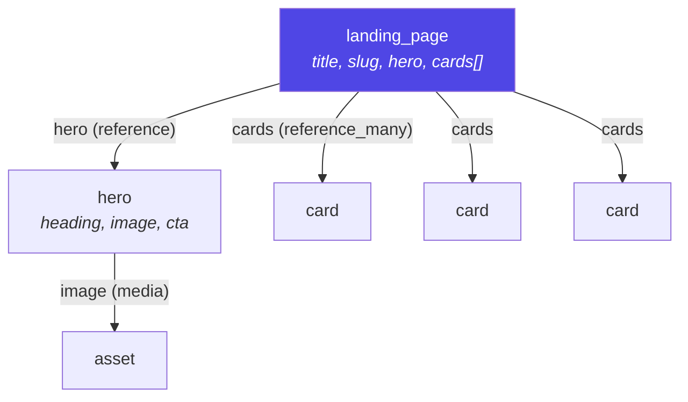
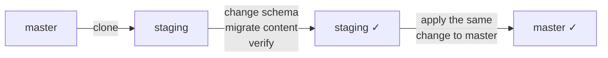

# Content modeling

A content type is a schema: an `api_id`, a display field, and an ordered list
of field definitions stored as JSONB. Adding a field is an `UPDATE`, not a
migration.

## Field definition

```json
{
  "id": "title",
  "name": "Page title",
  "type": "text",
  "localized": true,
  "help_text": "Shown in search results",
  "validations": { "required": true, "max_length": 120 },
  "allowed_content_types": []
}
```

| Key | Meaning |
|---|---|
| `id` | Stable API key — **renaming it orphans existing data** |
| `name` | Human label in the editor |
| `type` | One of the 15 below |
| `localized` | Store as `{locale: value}` instead of a plain value |
| `help_text` | Hint under the field |
| `validations` | See [Validation](#validation) |
| `allowed_content_types` | For references: which types may be linked |
| `fields` | For `group`: the sub-schema each repeated item follows |

`id` is what the Delivery API returns and what your templates read. `name` is
cosmetic and safe to change at any time.

## The 15 field types

| Type | Stores | Use for |
|---|---|---|
| `text` | string | Titles, names, labels |
| `longtext` | string | Multi-line plain text |
| `richtext` | ProseMirror JSON | Formatted body copy — see [Rich text](#rich-text) |
| `number` | int / float | Prices, counts, ordering |
| `boolean` | bool | Toggles |
| `datetime` | ISO 8601 string | Publish dates, events |
| `date` | ISO date | **Legacy** — use `datetime` |
| `select` | string | One of a fixed list (`allowed_values`) |
| `media` | asset UUID | One image, video or file |
| `media_many` | UUID[] | Ordered gallery |
| `reference` | entry UUID | Link to one entry |
| `reference_many` | UUID[] | Ordered links — **assemblies** |
| `json` | object | Escape hatch for arbitrary structure |
| `slug` | string | URL-safe identifier |
| `group` | object[] | **Repeatable multifield** — see [Multi-field groups](#multi-field-groups) |

`json` is deliberately last. It validates as "any object", so nothing in the
editor or the API can help you with its contents — reach for it only when the
shape genuinely varies.

## Multi-field groups

A `group` is a **repeatable container of sub-fields** — the same idea as an AEM
multifield. Use it when a page needs "three to five slides, each with a heading
and an image" and those slides are not worth managing as standalone entries.

```json
{
  "id": "slides",
  "name": "Slides",
  "type": "group",
  "validations": { "required": true, "min_items": 1, "max_items": 5 },
  "fields": [
    { "id": "heading", "name": "Heading", "type": "text",  "validations": { "required": true, "max_length": 60 } },
    { "id": "image",   "name": "Image",   "type": "media", "validations": {} },
    { "id": "link",    "name": "Link",    "type": "reference",
      "allowed_content_types": ["card"], "validations": {} }
  ]
}
```

The stored value is an **array of objects** keyed by sub-field id:

```json
{ "slides": [
    { "heading": "First",  "image": "9f2c…" },
    { "heading": "Second", "link": "a1b2…" }
]}
```

### Group vs `reference_many`

Both express "several of these", and picking the wrong one is the usual
modelling mistake:

| | `group` | `reference_many` |
|---|---|---|
| Stored | Inline, inside the parent entry | As separate entries, linked by id |
| Reusable elsewhere | No | Yes |
| Translated independently | No — the group localizes as a whole | Yes, per entry |
| Published independently | No | Yes |
| Shows in the entries list | No | Yes |
| Best for | Rows that only make sense here — slides, FAQ pairs, spec tables | Components shared across pages |

Rule of thumb: if you'd ever want to find the item on its own, it's an entry.

### Behaviour

- **Order is content.** The array order is the render order; editors reorder
  rows with the up/down controls.
- **`min_items` / `max_items`** bound the number of rows.
- **Validation is per row, and errors name the row** — a failed publish reports
  `slides[2]: Field 'heading' must be at most 10 characters`, so an editor
  knows which one to fix.
- **References and media inside a group still resolve** at delivery, and their
  `allowed_content_types` is still enforced.
- **Nesting is allowed** (a group of sections, each containing a group of
  cards), capped at 3 levels to stop a runaway schema.
- **Sub-fields are not individually localizable.** Localize the group as a
  whole — a locale map inside every row would make the delivered shape far
  harder to consume.
- A group with **no sub-fields** is a schema error, not an empty container.

### Consuming it

The content type ships with every delivery response, so a renderer can walk
`field.fields` and handle rows generically — no per-content-type code:

```tsx
{entry.fields.slides?.map((row, i) => (
  <Slide key={i} heading={row.heading} image={resolve(row.image)} />
))}
```

## Assemblies

`reference_many` is how page-builder composition works: a page holds an ordered
list of component entries rather than a fixed set of fields.



Editors reorder cards by dragging; the array order *is* the render order. Each
`card` is an ordinary entry, so it can be reused across pages, translated
independently, and published on its own schedule.

Constrain what can be linked:

```json
{ "id": "cards", "type": "reference_many",
  "allowed_content_types": ["card", "quote"],
  "validations": { "min_items": 1, "max_items": 6 } }
```

Leave `allowed_content_types` empty to permit any type — convenient, but it
gives editors a picker listing every entry in the space.

## Localization

Mark a field `localized: true` and it stores a map:

```jsonc
// stored
{ "title": { "en-US": "Welcome", "fr": "Bienvenue" },
  "slug":  "home" }                                  // not localized

// delivered with ?locale=fr
{ "title": "Bienvenue", "slug": "home" }
```

Rules worth knowing:

- **`required` is satisfied by the default locale.** A French translation can
  lag without blocking publication.
- Validation runs **per locale** — a `max_length` applies to each translation
  separately.
- `?locale=*` returns the raw maps, for translation tooling.
- Toggling `localized` on an existing field does not migrate stored values;
  do it before there is content, or fix the data deliberately.

Which fields to localize: prose yes, slugs and enum keys usually no — a
localized slug means per-locale URLs, which is a routing decision, not a
content one.

## Validation

`core/validation.py` is pure functions with no database access, which is why
it's directly unit-tested. Reference *existence* is checked separately, in the
entries API, because that needs queries.

| Rule | Applies to | Effect |
|---|---|---|
| `required` | any | Must be present and non-empty (default locale for localized fields) |
| `min_length` / `max_length` | strings | Character bounds |
| `pattern` | strings | Regex, matched with `re.search` |
| `allowed_values` | strings | Must be one of the list — this is what `select` uses |
| `min` / `max` | numbers | Numeric bounds (booleans excluded) |
| `min_items` / `max_items` | arrays | Length bounds for `*_many` |

An **invalid regex in the model does not block editors** — the pattern is
skipped rather than raising. A typo in a schema shouldn't stop a content team
working.

Validation runs on save and again on publish. Publish additionally verifies
every referenced id still exists, so you cannot publish a page whose hero was
deleted.

## Rich text

`richtext` stores a **ProseMirror JSON document**, not HTML:

```json
{ "type": "doc", "content": [
  { "type": "paragraph", "content": [ { "type": "text", "text": "Hello" } ] }
]}
```

Structured storage means it can be rendered to anything — HTML, React Native,
plain text for search — and validated. `core/richtext.py` checks the document
shape server-side; legacy HTML strings are still accepted for compatibility.

Supported: headings, bold/italic/underline/strike, inline code, colour and
highlight, links, bullet and ordered lists, blockquote, code block, horizontal
rule, tables, and **embedded entries and assets** as block or inline nodes.

Restrict what a field allows via its config — a `summary` field can permit bold
and links but no headings or tables, which keeps editors inside your design
system rather than relying on convention.

## Naming

| | Convention | Example |
|---|---|---|
| `api_id` | `snake_case`, singular | `landing_page` |
| Field `id` | `snake_case` | `hero_image` |
| Display name | Title Case | `Landing Page` |

`display_field` picks which field labels an entry in lists and pickers —
usually `title`. Set it, or editors browse a list of UUIDs.

## Evolving a schema safely



Because content types are **environment-scoped**, cloning gives you a full copy
of schema *and* entries — with every reference id remapped — to rehearse
against. Then:

| Change | Safe? |
|---|---|
| Add an optional field | Yes |
| Rename `name`, edit `help_text` | Yes |
| Reorder fields | Yes — affects editor layout only |
| Widen validation (raise `max_length`) | Yes |
| Add a `required` field | **No** — existing entries fail validation on next publish |
| Rename a field `id` | **No** — orphans the stored data |
| Narrow validation | **No** — existing content may already violate it |
| Change a field's `type` | **No** — stored values won't match |

For a breaking change, add the new field alongside the old, backfill, switch
your templates, then remove the old one.

`PUT /content-types/{id}` replaces the whole `fields` array — send all of them,
in order.

## Where to go next

- Serving it → [06-api/delivery-api.md](06-api/delivery-api.md)
- Tables behind it → [05-data-model.md](05-data-model.md)
- AI help with content → [11-ai-features.md](11-ai-features.md)
