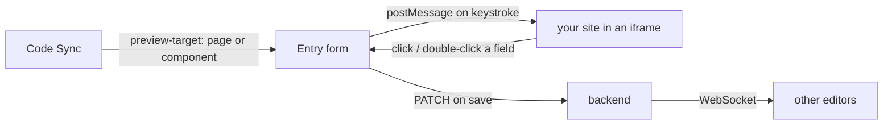

# Frontend apps

Three Next.js 14 App Router apps, each an ordinary API client with no database
access. They share conventions but ship independently.

| App | Port | Audience |
|---|---|---|
| `editor/` | 3000 | Content teams — the main product |
| `preview/` | 3001 | Reference instrumented site; **your own site replaces it** via [Code Sync](20-code-sync.md) |
| `superadmin/` | 3003 | Platform operators, across all tenants |

## Editor

```
editor/src/
  app/                      App Router routes
    login, signup, verify-email, forgot-password, reset-password,
    accept-invite/[token], onboarding          ← no app chrome
    content-types/, entries/, media/, guidelines/
    settings/ + 8 sub-pages
    profile/, support/, help/, legal/[slug]/
    403, maintenance, offline, session-expired,
    not-found.tsx, error.tsx                   ← UX states
    globals.css                                ← the whole design system
  components/
    AppShell.tsx            topbar, sidebar, mobile drawer
    DynamicEntryForm.tsx    renders a form FROM the content type schema
    LivePreviewPane.tsx     the iframe + postMessage bridge
    InlineEditorOverlay.tsx click-to-edit inside the preview
    RichTextField.tsx       TipTap editor
    ReferencePicker.tsx, MediaPicker.tsx, VersionHistory.tsx, AISidebar.tsx
    ui/                     Icon, Select, PasswordInput, StatusPage, LegalFooter
    ui.tsx                  Modal, ConfirmDialog, EmptyState, toasts
  lib/
    api.ts                  fetch wrapper: auth headers, 401 refresh, retry
    workspace.tsx           WorkspaceProvider — user, space, environment
    useEntrySocket.ts       WebSocket hook for live sync
    types.ts                shared types + FIELD_TYPE_INFO
    legal.tsx               legal document registry
```

### State

Deliberately minimal: **React context plus local state**, no client state
library. There are only two pieces of genuinely global state.

`WorkspaceProvider` holds the current user, the selected space and the selected
environment, persisting the last two in `localStorage`. Every content page
builds its paths from `envPath`:

```tsx
const { envPath, can, user } = useWorkspace();
const entries = await api(`${envPath}/entries`);   // /spaces/{id}/environments/{key}/entries
```

Switching space or environment therefore re-scopes the entire editor with no
per-page wiring.

`can('manage_entries')` hides controls the user can't use. It is a **UI
convenience only** — the server re-checks every request, so a tampered client
gains nothing.

### The API wrapper

`lib/api.ts` attaches the bearer token, and on a `401` transparently refreshes
and retries **once** before giving up and redirecting to login. That's why no
page contains token-refresh logic.

### Schema-driven forms

`DynamicEntryForm` reads the content type's `fields[]` and renders the matching
widget per type. Adding a field type means adding one case there and one entry
in `FIELD_TYPE_INFO` — no per-content-type code exists anywhere.

### Live preview

The pane loads **your project's deployed site**, not a generic rendering — the
Adobe Universal Editor arrangement. Which site, which page and which component
come from [Code Sync](20-code-sync.md); with no repository connected the pane
offers *Connect with GitHub* instead of showing a frame.



Typing patches the iframe's DOM directly with **no network round trip**, which
is what makes it feel instant. Only saving hits the API. The site annotates its
markup with `data-ondros-*` attributes so a clicked node maps back to a field
id, and loads `/code-sync/ondros-editor.js` to speak the protocol.

An entry whose type models a slug previews at its own URL (*page-wise*); a
block previews inside a page that references it, scrolled to and outlined
(*component-wise*).

## Preview

The demo consumer. Its job is to show what integration looks like:

```
preview/src/
  app/               routes + draft mode API handlers
  components/
    EntryRenderer.tsx        renders any entry from its schema, recursively
    InlineEditingBridge.tsx  the iframe side of the editing protocol
    Icon.tsx                 Bootstrap Icons
  lib/cms.ts                 delivery fetch + include-map helpers
```

Server-side fetches use `CMS_API_URL` over the Docker network; browser-side
WebSocket and media use `NEXT_PUBLIC_API_URL`. That split is why both exist.

Next.js **draft mode** selects the preview token instead of the delivery token,
which is the whole published/draft switch in one flag.

`EntryRenderer` walks the content type schema and renders nested assemblies
recursively, bounded by `MAX_NESTING`.

> This app is a **reference implementation**, not a product. It emits both
> `data-ondros-*` (the [Code Sync](20-code-sync.md) contract) and the older
> `data-cms-*` attributes, and loads the bridge script from the backend — so it
> is a working example of what your own site needs to do. Connect your real
> site through Code Sync and this app stops being in the loop.

## Superadmin

Small by design — a shell, an auth gate and read-mostly dashboards:

```
superadmin/src/
  app/       login, overview, accounts, users, revenue, usage, health
  components/Shell.tsx, Icon.tsx, PasswordInput.tsx
  lib/api.ts
```

`Shell` calls `GET /platform/me` on mount and bounces anyone who isn't a
platform admin. It runs on its own port with its own deployment so it can be
firewalled separately from the customer-facing editor.

## Shared conventions

All three apps follow the same rules, documented in
[10-ui-conventions.md](10-ui-conventions.md) and enforced by review:

| | |
|---|---|
| Icons | Bootstrap Icons **webfont** via each app's `Icon` component |
| Dropdowns | `ui/Select` — never a native `<select>` |
| Fonts | Plus Jakarta Sans + JetBrains Mono, vendored, via `--font`/`--mono` |
| Styling | Plain CSS with custom properties in `globals.css`. No framework |
| Type safety | `npm run typecheck` per app |

## Responsive behaviour

The editor is desktop-first with a `900px` breakpoint:

- Sidebar becomes an off-canvas drawer with a burger and scrim
- Space/environment/account pickers move **into** that drawer
- The user chip collapses to an avatar; sign-out becomes an icon
- Editor form, preview and AI rail stack vertically
- Tables scroll inside `.table-wrap` rather than scrolling the page

## Running one

```bash
docker compose up -d editor
docker compose exec editor npm run typecheck
docker compose logs -f editor
```

Each app's `src/` is volume-mounted, so edits hot-reload. `--build` is only
needed when dependencies change — and because `NEXT_PUBLIC_*` values are
inlined at build time, changing one requires a rebuild too.

## Where to go next

- The rules → [10-ui-conventions.md](10-ui-conventions.md)
- The APIs they call → [06-api/README.md](06-api/README.md)
- Live sync protocol → [06-api/websocket-api.md](06-api/websocket-api.md)
