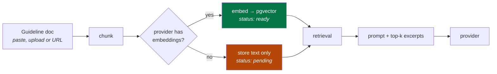

# AI features

Optional, provider-agnostic assistance grounded in your own brand guidelines.
**Off by default** — every `/ai/*` route returns `503` until a provider is
configured, and everything else works without one.

## Providers

Every option uses the same OpenAI-compatible code path, so switching provider
is a config change, not a code change.

| Provider | Cost | Embeddings | Notes |
|---|---|---|---|
| `groq` | Free tier | No → keyword retrieval | Fastest. [console.groq.com](https://console.groq.com) |
| `gemini` | Free tier | **Yes** — set `EMBEDDING_DIM=768` | [aistudio.google.com](https://aistudio.google.com/apikey) |
| `ollama` | Free, fully local | **Yes** — `EMBEDDING_DIM=768` | Needs `ollama serve`; nothing leaves your machine |
| `openrouter` | Free models available | No → keyword retrieval | |
| `openai` | Paid | Yes | |
| `azure_openai` | Paid | Yes | Uses the `AZURE_OPENAI_*` settings |

```bash
# .env
AI_PROVIDER=groq
AI_API_KEY=gsk_...
```

Leaving `AI_PROVIDER` empty triggers auto-detection: Azure if
`AZURE_OPENAI_API_KEY` is set, otherwise the provider matching `AI_API_KEY`,
otherwise none.

```bash
curl localhost:8000/ai/status -H "Authorization: Bearer $TOKEN"
# { "configured": true, "provider": "groq", "chat_model": "…",
#   "embeddings_enabled": false, "retrieval_mode": "keyword" }
```

## Features

| Endpoint | What it does |
|---|---|
| `POST /ai/generate-entry` | Draft a whole entry from a brief, respecting the content type's schema |
| `POST /ai/transform-field` | Rewrite / shorten / expand / adjust tone on one field |
| `POST /ai/suggest-titles` | Title options for the current content |
| `POST /ai/seo-meta` | Meta title and description |
| `POST /ai/translate-fields` | Translate between any two of the space's locales |
| `POST /ai/check-compliance` | Check the draft against your ingested guidelines |
| `GET /ai/status` | Active provider and retrieval mode |

All require the `use_ai` capability — held by ORG_ADMIN, SPACE_ADMIN, EDITOR
and AUTHOR, but not VIEWER.

In the editor these appear in the AI sidebar on the entry screen, including an
`en-US → fr` translate button.

## Guideline grounding

Generic model output ignores your house style. Ingest your guidelines and every
feature is prompted with the relevant excerpts.



| Method | Path | Purpose |
|---|---|---|
| `POST` | `/guidelines` | Add a document from text |
| `POST` | `/guidelines/upload` | Add from a file |
| `POST` | `/guidelines/{id}/ingest` | Chunk and embed |
| `GET` | `/guidelines/search` | Inspect what retrieval returns for a query |
| `GET` `DELETE` | `/guidelines[/{id}]` | List, remove |

Documents can be scoped to particular content types, so landing-page rules
don't leak into blog-post generation.

## Two retrieval modes

Selected automatically, never configured:

| | **vector** | **keyword** |
|---|---|---|
| When | Provider supports embeddings **and** chunks are embedded | Chat-only provider, or unembedded chunks |
| How | pgvector cosine-distance top-k | Term-overlap scoring |
| Quality | Better — matches meaning | Adequate — matches words |

Both apply identical scoping: **tenant is a hard boundary**, then optional
space and content-type filters. A guideline from one account can never reach
another account's prompt.

The fallback is defensive, not just for chat-only providers: a dimension
mismatch, an unembedded chunk or a vector query error all fall back to keyword
search rather than failing the request. Degraded output beats a broken button.

### `EMBEDDING_DIM` is fixed at first ingest

The pgvector column is created with this width and **cannot be changed
afterwards without recreating it**:

| Provider | Value |
|---|---|
| OpenAI / Azure | `1536` (default) |
| Gemini / Ollama | `768` |

Set it **before ingesting anything**. If you switch providers later, drop and
re-ingest your guidelines.

## Privacy

Be straightforward with your users about this — the
[privacy policy template](../editor/src/lib/legal.tsx) already is:

- Text you submit to an AI feature, plus the retrieved guideline excerpts, is
  sent to the configured provider and processed under **their** terms.
- Content is not used to train models by this application; what the provider
  does is governed by your agreement with them.
- `AI_PROVIDER=ollama` keeps everything on your own hardware — the only option
  where no content leaves your infrastructure.
- With no provider configured, no content is sent anywhere.

## Output is a suggestion

AI output can be confidently wrong, and it may miss your guidelines even when
they were supplied. The editor always writes suggestions into the **draft**,
never to published content, so a human publishes. Keep it that way.

## Costs and limits

- Free tiers rate-limit aggressively; a `429` from the provider surfaces as an
  error in the sidebar.
- Generation is the most expensive call; `transform-field` on one field is much
  cheaper than `generate-entry`.
- AI calls count toward your plan's API-call meter like any other request.

## Local AI with Ollama

```bash
ollama pull llama3.1 && ollama pull nomic-embed-text
ollama serve
```

```bash
# .env
AI_PROVIDER=ollama
EMBEDDING_DIM=768
AI_BASE_URL=http://host.docker.internal:11434/v1
```

From inside Docker, `localhost` is the container — use
`host.docker.internal` to reach the host.

## Where to go next

- Endpoint details → [06-api/management-api.md](06-api/management-api.md)
- Configuration → [18-configuration.md](18-configuration.md)
- Where AI writes → [08-content-modeling.md](08-content-modeling.md)
