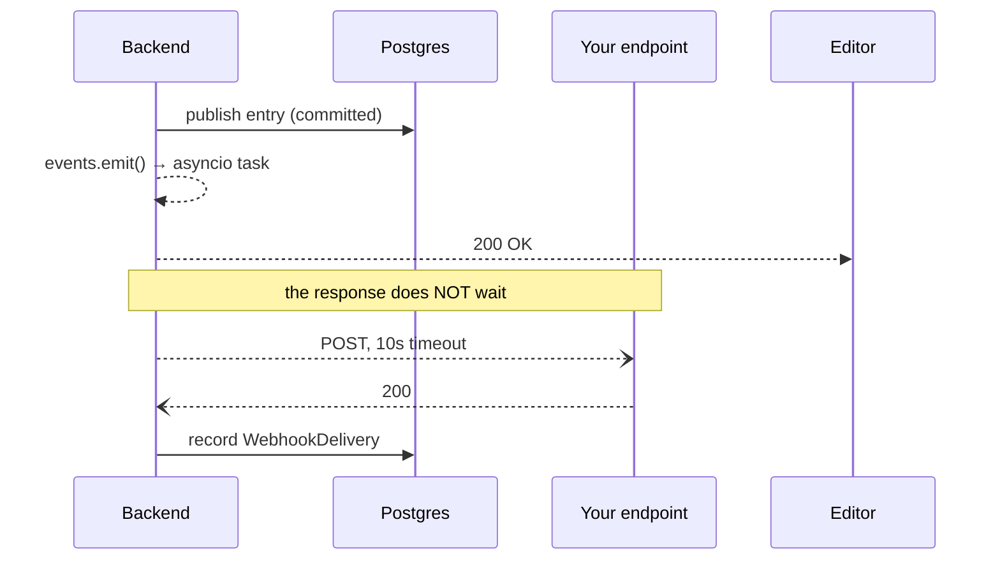

# Webhooks

Outbound HTTP notifications when content changes — the right way to invalidate
a CDN or trigger a rebuild, instead of polling the Delivery API.

## Event types

Thirteen, from `core/events.py`:

| Group | Events |
|---|---|
| Entries | `entry.create` · `entry.update` · `entry.publish` · `entry.unpublish` · `entry.archive` · `entry.delete` |
| Content types | `content_type.create` · `content_type.update` · `content_type.delete` |
| Assets | `asset.create` · `asset.update` · `asset.delete` |
| Environments | `environment.create` |

`GET /spaces/{space_id}/webhooks/event-types` returns the live list.

For cache invalidation you usually want `entry.publish`, `entry.unpublish` and
`entry.delete` — the three that change what the public can see. `entry.update`
fires on every draft save, which is noisy and does not affect published output.

## Creating one

```bash
curl -X POST "localhost:8000/spaces/$SPACE/webhooks" \
  -H "Authorization: Bearer $TOKEN" -H 'Content-Type: application/json' \
  -d '{
    "name": "Rebuild site",
    "url": "https://api.vercel.com/v1/integrations/deploy/…",
    "secret": "a-long-random-string",
    "events": ["entry.publish", "entry.unpublish", "entry.delete"],
    "filters": { "content_types": ["landing_page"], "environments": ["master"] },
    "headers": { "X-Custom": "value" }
  }'
```

| Field | Notes |
|---|---|
| `url` | Your endpoint. HTTPS in production |
| `secret` | Used to HMAC-sign the body. Omit and payloads are unsigned |
| `events` | Which events to receive. Empty means all |
| `filters` | Optional `content_types[]` and/or `environments[]` narrowing (api_ids / env keys). Empty array = no filter |
| `headers` | Extra headers, e.g. an auth token for your endpoint |
| `enabled` | Set `false` to pause without deleting |

Filters matter: without `environments: ["master"]`, a colleague publishing in
`staging` rebuilds production.

## Payload

```jsonc
POST https://your-endpoint.example.com
Content-Type: application/json
X-CMS-Event: entry.publish
X-CMS-Webhook-Id: 7c1e…
X-CMS-Signature: sha256=3f9a…      // only when a secret is set

{
  "event": "entry.publish",
  "spaceId": "ba300ee4-…",
  "environment": "master",
  "contentType": "landing_page",
  "payload": {
    "id": "b18c1722-…",
    "slug": "home",
    "status": "published",
    "version": 8
    // …event-specific fields
  }
}
```

The envelope is stable across event types; `payload` varies.

## Verifying the signature

**Always verify before acting.** Your endpoint is a public URL, and a rebuild
trigger is a denial-of-service vector if anyone can fire it.

`X-CMS-Signature` is `sha256=` followed by
`HMAC-SHA256(secret, raw_request_body)`.

```js
import crypto from 'node:crypto';

function verify(rawBody, signature, secret) {
  const expected = 'sha256=' +
    crypto.createHmac('sha256', secret).update(rawBody).digest('hex');
  // Constant-time compare — a plain === leaks timing information
  const a = Buffer.from(signature ?? '');
  const b = Buffer.from(expected);
  return a.length === b.length && crypto.timingSafeEqual(a, b);
}
```

```python
import hashlib, hmac

def verify(raw_body: bytes, signature: str, secret: str) -> bool:
    expected = "sha256=" + hmac.new(secret.encode(), raw_body, hashlib.sha256).hexdigest()
    return hmac.compare_digest(signature or "", expected)
```

Sign the **raw bytes**, before any JSON parsing — re-serializing changes key
order and whitespace, and the signature won't match.

## Delivery semantics



| Property | Behaviour |
|---|---|
| Timing | **Fire-and-forget** — dispatch never blocks the API response |
| Timeout | 10 seconds per delivery |
| Retries | **None.** A failed delivery is logged, not retried |
| Ordering | Not guaranteed — concurrent tasks may arrive out of order |
| Delivery | At-most-once. A restart mid-flight loses in-flight deliveries |
| Failure isolation | A dispatch error can never break the request that triggered it |

These are real limitations, and the trade is deliberate: publishing stays fast
and a dead receiver cannot wedge the editor.

**Design your receiver accordingly:**

- Make it **idempotent** — the same event may arrive twice, or out of order.
- Don't use it as the only source of truth. For a critical sync, reconcile
  periodically against the Delivery API.
- Return `2xx` quickly and do the slow work in the background; you have 10s.
- Treat the payload as a **notification, not data** — re-fetch the entry if you
  need its full current state.

## Delivery log

Every attempt is recorded — status code, response body (truncated at 2000
bytes), duration and success flag:

```bash
curl "localhost:8000/spaces/$SPACE/webhooks/$HOOK/deliveries" \
  -H "Authorization: Bearer $TOKEN"
```

The last **50 deliveries** per webhook are kept; older rows are pruned. Also
visible in the editor under Settings → Webhooks, which is the fastest way to
debug "my rebuild didn't fire".

## Common recipes

**Vercel / Netlify rebuild** — point `url` at the deploy hook, subscribe to
`entry.publish` / `entry.unpublish` / `entry.delete`, filter to `master`.

**Next.js on-demand revalidation**

```ts
// app/api/cms-hook/route.ts
import { revalidatePath } from 'next/cache';

export async function POST(req: Request) {
  const raw = await req.text();                       // raw bytes first
  if (!verify(raw, req.headers.get('x-cms-signature'), process.env.CMS_WEBHOOK_SECRET!)) {
    return new Response('bad signature', { status: 401 });
  }
  const { payload } = JSON.parse(raw);
  revalidatePath(`/${payload.slug}`);
  return Response.json({ revalidated: true });
}
```

**Slack notification** — subscribe to `entry.publish` and post to an incoming
webhook URL. Use `filters.content_types` so only the types you care about ping
the channel.

## Troubleshooting

| Symptom | Likely cause |
|---|---|
| Nothing arrives | Webhook `enabled: false`, event not subscribed, or a filter excluding it |
| Signature never matches | Verifying re-serialized JSON instead of the raw body |
| Fires for the wrong environment | No `environments` filter |
| Fires constantly | Subscribed to `entry.update`, which fires on every draft save |
| Log shows a timeout | Receiver took over 10s — acknowledge first, work after |

## Where to go next

- Managing webhooks over the API → [06-api/management-api.md](06-api/management-api.md)
- What "published" means → [08-content-modeling.md](08-content-modeling.md)
- Fetching the content → [06-api/delivery-api.md](06-api/delivery-api.md)
