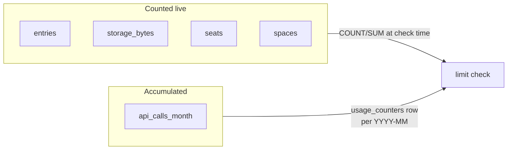
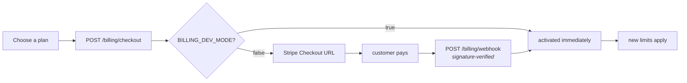

# Billing & usage

Plans, metering and limit enforcement. Stripe is optional — `BILLING_DEV_MODE`
lets you exercise the whole flow without payment keys.

## Plans

Seeded defaults (`GET /billing/plans` returns the live values):

| | Free | Starter — $29/mo | Pro — $99/mo |
|---|---|---|---|
| Seats | 2 | 10 | 50 |
| Spaces | **1** | 3 | 20 |
| Entries | 500 | 10,000 | 100,000 |
| Storage | 100 MB | 5 GB | 50 GB |
| API calls / month | 10,000 | 500,000 | 5,000,000 |

Limits are **per account**, not per user — three admins in one organization
share one budget. Edit the `plans` table to change them; nothing is hard-coded
in the frontend.

## Metered usage



Four metrics are **computed on demand** — `COUNT(entries)`, `SUM(size_bytes)`,
`COUNT(seats)`, `COUNT(spaces)`. They can never drift from reality, and
deleting content immediately frees headroom.

`api_calls_month` is different: it's incremented per request into a
`usage_counters` row keyed by `YYYY-MM`, via an upsert. It resets naturally
each month because a new period means a new row.

```bash
curl localhost:8000/billing/subscription -H "Authorization: Bearer $TOKEN"
# { "plan": {...}, "status": "active", "usage": { "entries": 12, "spaces": 1, … },
#   "current_period_end": "...", "dev_mode": true }
```

## Two kinds of enforcement

### Creation limits → `402`

Checked *before* creating a resource, by `usage.ensure_within_limit`:

```json
{
  "detail": {
    "code": "plan_limit_reached",
    "metric": "spaces",
    "limit": 1,
    "used": 1,
    "plan": "free",
    "message": "Your free plan allows 1 spaces. Upgrade to add more."
  }
}
```

`402 Payment Required` is used deliberately rather than `403`: this isn't a
permissions problem, and the structured body lets a client show the right
upgrade prompt instead of a generic error.

### API quota → `429`

When the monthly call quota is exhausted, requests return `429` with a
`Retry-After` pointing at the end of the month.

| Status | Meaning | Fix |
|---|---|---|
| `402` | A resource limit would be exceeded | Upgrade, or delete something |
| `429` | Monthly API calls exhausted | Upgrade, or wait for the reset |

A limit of `0` or a missing key means **unlimited** — `ensure_within_limit`
returns early. That's how you make an internal plan with no ceilings.

## Going over on a downgrade

Downgrading below your current usage does **not** delete anything. Existing
content stays; you simply can't create more of the over-limit resource until
you're back under. Export or prune at your own pace — a CMS that deletes your
content because a card expired would be indefensible.

## Changing plans



| Endpoint | Purpose |
|---|---|
| `GET /billing/plans` | Plan catalogue |
| `GET /billing/subscription` | Current plan, usage, period end |
| `POST /billing/checkout` | Returns `{checkout_url}`, or activates directly in dev mode |
| `POST /billing/dev-activate` | Switch plan with no payment — dev mode only |
| `POST /billing/webhook` | Stripe's callback. Not for your code |

**Cancelling is a downgrade to `free`.** There is no separate cancel endpoint —
`/billing/cancel` in the editor is a confirmation screen around that same plan
change.

The plan only updates when Stripe **confirms** payment, which is why the
payment-result pages say to refresh if the plan still looks stale: the browser
returns from Checkout before the webhook necessarily lands.

## Dev mode

```bash
# .env
BILLING_DEV_MODE=true
```

Enables `POST /billing/dev-activate`, so you can exercise limits end to end
without Stripe:

```bash
# Verify the free-plan space limit
curl -X POST localhost:8000/billing/dev-activate -H "Authorization: Bearer $TOKEN" \
  -H 'Content-Type: application/json' -d '{"plan_key":"free"}'
curl -X POST localhost:8000/spaces -H "Authorization: Bearer $TOKEN" \
  -H 'Content-Type: application/json' \
  -d '{"name":"Second","slug":"second","locales":[{"code":"en-US","name":"English"}],"default_locale":"en-US"}'
# → 402 plan_limit_reached
```

> **Set `BILLING_DEV_MODE=false` anywhere real.** With it on, any user holding
> `manage_settings` can grant themselves the Pro plan.

## Going live with Stripe

1. Create products and prices in Stripe; put each price id in the matching
   `plans.stripe_price_id`.
2. Set `STRIPE_SECRET_KEY` and `STRIPE_WEBHOOK_SECRET`.
3. Point a Stripe webhook at `POST /billing/webhook`.
4. Set `BILLING_DEV_MODE=false`.

Card details never reach this application — Stripe Checkout handles them, which
is what keeps your PCI scope minimal.

## Where to go next

- Endpoints → [06-api/management-api.md](06-api/management-api.md)
- Configuration → [18-configuration.md](18-configuration.md)
- Cross-tenant revenue view → [06-api/platform-admin-api.md](06-api/platform-admin-api.md)
