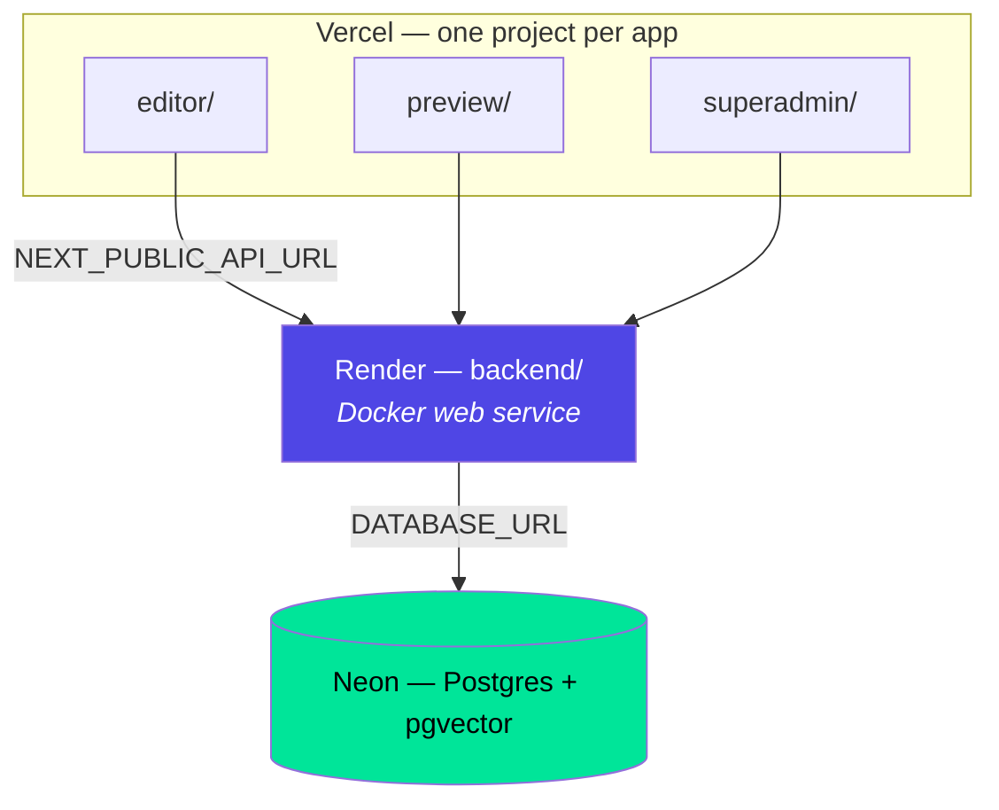

# Deployment

Two guides, same stack, different amount of decision-making.

| Guide | Use when |
|---|---|
| [free-tier.md](free-tier.md) | You want the general reference, including the alternatives at each step (Render *or* Railway, Neon *or* Supabase, or fully local) |
| [vercel-neon-render.md](vercel-neon-render.md) | You've already chosen Vercel + Neon + Render and want a runbook with exact values |

Both target a **zero-cost** deployment suitable for demos, coursework and
portfolios — not production hosting. The limitations are real and documented in
each guide.

## What goes where



The backend is the only thing that touches the database. Every frontend is an
API client, which is why they deploy independently and why a database URL must
never appear in a Vercel project.

## Before you start

This is a **monorepo with no root Dockerfile** — each app has its own, in its
own folder. Both hosts need to be told which subdirectory to build:

| Host | Setting |
|---|---|
| Render | **Root Directory** = `backend` |
| Vercel | **Root Directory** = `editor` / `preview` / `superadmin` |

Getting this wrong produces
`failed to read dockerfile: open Dockerfile: no such file or directory`, which
looks like a missing file and is actually a missing setting.

## The ordering problem

The backend needs the frontend URLs (`CORS_ORIGINS`) and the frontends need the
backend URL (`NEXT_PUBLIC_API_URL`). Neither exists first, so deployment takes a
deliberate second pass:

```
1. Neon    → DATABASE_URL
2. Render  → deploy with placeholder frontend URLs → get the API URL
3. Vercel  → deploy with the real API URL          → get the app URLs
4. Render  → go back and set the real CORS_ORIGINS
```

Skipping step 4 is the most common cause of "it deployed but login does
nothing" — the browser blocks the cross-origin call and there is no server-side
trace of it at all.

## Known-sharp edges

Each is explained in the guides; listed here so you can scan for them:

| Problem | Cause |
|---|---|
| Backend boot-loops with a `TypeError` about `sslmode` | The `?sslmode=…` tail is still on `DATABASE_URL`; asyncpg rejects libpq options |
| `prepared statement "__asyncpg_…" does not exist` | Neon's **pooled** endpoint breaks SQLAlchemy's prepared statements — use the direct one |
| Editor still calls `localhost:8000` | `NEXT_PUBLIC_*` is inlined at build time; the project wasn't rebuilt |
| Signup works but no email arrives | No SMTP — the link is only in the server log |
| Images 404 after a deploy | Ephemeral disk; see [18-configuration.md](../18-configuration.md#media-storage) |
| First request hangs ~60s | Normal free-tier cold start |

## Alternatives

- **Fully local** — `docker compose up -d`, no accounts, no cost. See
  [04-getting-started.md](../04-getting-started.md).
- **Single VM** — `docker-compose.prod.yml` and the `Caddyfile` at the repo
  root run all five services behind Caddy on one host. Set `PUBLIC_HOST`.
- **Railway / Supabase** — drop-in replacements for Render / Neon; the env vars
  are identical.

## Where to go next

- Every variable → [18-configuration.md](../18-configuration.md)
- Hardening → [07-auth-and-permissions.md](../07-auth-and-permissions.md#hardening-checklist)
