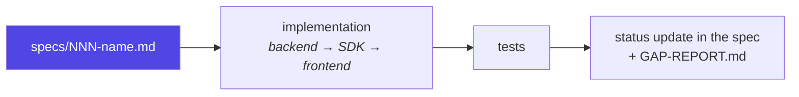

# Contributing

How work gets made in this repo.

## Spec-driven development

Every feature ships through a spec in [`specs/`](../specs):



Four rules, from [`specs/README.md`](../specs/README.md):

1. **Spec first.** A workstream doesn't start until its spec records: current
   state, requirements, data model, API surface, acceptance criteria, tasks.
2. **Additive changes.** Specs extend the existing architecture — each opens
   with a *Current state* section — rather than rewriting it.
3. **Status lives in the spec** as task checkboxes, rolled up in
   [`GAP-REPORT.md`](../specs/GAP-REPORT.md).
4. **Acceptance criteria map to tests** — `backend/tests/` for the backend,
   `tsc --noEmit` plus a manual smoke script for the frontend.

Fifteen specs exist (001–015). Read the nearest one before changing an area;
it usually explains why something is the way it is.

## Setup

```bash
cp .env.example .env
docker compose up --build -d
docker compose exec backend python -m app.seed
```

Full walkthrough: [04-getting-started.md](04-getting-started.md).

## Before you open a PR

```bash
# Backend
docker compose up -d db
docker compose run --rm --entrypoint sh backend \
  -c "pip install -q -r requirements-dev.txt && pytest"

# Frontends
docker compose exec editor     npm run typecheck
docker compose exec preview    npm run typecheck
docker compose exec superadmin npm run typecheck
```

If you touched the frontend, re-read [10-ui-conventions.md](10-ui-conventions.md)
and self-check the diff:

```bash
grep -rn "<select"                      editor/src preview/src superadmin/src
grep -rn "<svg\|react-bootstrap-icons"  editor/src preview/src superadmin/src
```

Both should find nothing outside the icon modules themselves.

## Code conventions

### Backend

- `core/` holds domain logic and **knows nothing about FastAPI** — that's what
  makes `validation.py` and `permissions.py` directly unit-testable.
- `api/` routers stay thin: authenticate via `deps.py`, call into `core/`,
  serialize.
- Never read the tenant from a request body or parameter. It comes from
  `Actor.tenant_id`, which comes from the validated JWT claim.
- New endpoints get a capability check, even read-only ones.
- Requirements pin **floors, not ceilings** (`fastapi>=0.115,<1`).

### Frontend

- Server components by default; `'use client'` only when you need interactivity.
- Shared primitives go in `components/ui/`, not copied between pages.
- Style with design tokens (`var(--primary)`), never literal colours.
- New field types need one case in `DynamicEntryForm` and one entry in
  `FIELD_TYPE_INFO`.

### Comments

Explain **why**, not what. The codebase's existing comments are the model —
they document the reasoning that isn't visible in the code:

```python
# Shell form so $PORT expands — hosts like Render inject PORT and require the
# container to bind to it; falls back to 8000 for plain `docker run`/local use.
```

Don't narrate the obvious. Do record the constraint that made you write it this
way, because that's what the next person can't reconstruct.

## Commits

Conventional-commit prefixes: `feat(scope):`, `fix(scope):`, `docs:`,
`chore(scope):`.

Write the body for whoever hits `git blame` in six months — what changed, and
crucially *why*. A commit that says "fix mobile" is worth less than one
explaining that the pickers were rendering in both the topbar and the drawer
because of a CSS cascade order problem.

## Documentation

If you change behaviour, update the page that describes it. The
[docs index](README.md) maps areas to files.

Documentation claims should be **verified against the running system**, not
written from memory. Several errors in the first draft of these docs — the
shape of `includes`, the cost of `include` depth — were caught exactly that way.

## Known gaps

Honest starting points, all documented in their own pages:

| Gap | Where |
|---|---|
| WebSocket manager is in-process, so >1 replica breaks live preview | [06-api/websocket-api.md](06-api/websocket-api.md) |
| WebSocket accepts unauthenticated read-only connections | [06-api/websocket-api.md](06-api/websocket-api.md) |
| Webhooks have no retry and no delivery guarantee | [12-webhooks.md](12-webhooks.md) |
| Media on local disk | [18-configuration.md](18-configuration.md#media-storage) |
| Boot-time `create_all` instead of Alembic by default | [18-configuration.md](18-configuration.md#migrations) |
| No frontend component or E2E tests | [16-testing.md](16-testing.md#frontend) |
| SAML scaffolded but not runtime-enabled | [07-auth-and-permissions.md](07-auth-and-permissions.md) |
| Editor stores JWTs in `localStorage` | [07-auth-and-permissions.md](07-auth-and-permissions.md#hardening-checklist) |

## Where to go next

- Architecture → [02-architecture.md](02-architecture.md)
- Specs → [`specs/README.md`](../specs/README.md)
- UI rules → [10-ui-conventions.md](10-ui-conventions.md)
